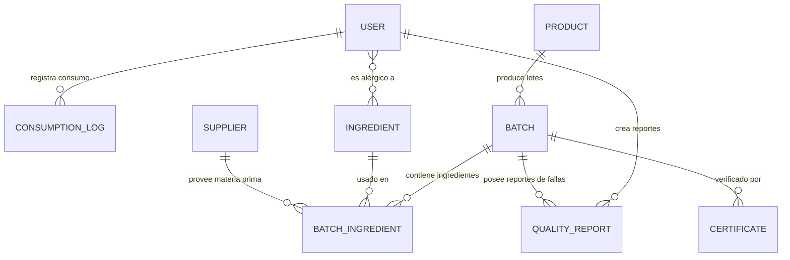

# NutriTrack - Trazabilidad Alimentaria para el Sector Fitness

## Información del Curso y Equipo
* **Curso:** CS 2031 Desarrollo Basado en Plataforma (DBP) - UTEC
* **Integrantes del Equipo y Asignación de Tareas:**
  * **Víctor Valentino Palomino Arcos** (Encargado de Seguridad, JWT, CORS e integración con AWS ECR/ECS)
  * **Nestor Alonso De la Cruz Gomez** (Encargado de la Capa de Datos, JPA, Repositorios, ZXing QR y AWS S3)
  * **Keneth Joseph Urbizagastegui Fernández** (Encargado de la lógica de negocio, Servicios, Eventos Asíncronos y Testing unitario/integrado con Testcontainers)

---

## Índice
1. [Introducción](#introducción)
2. [Identificación del Problema o Necesidad](#identificación-del-problema-o-necesidad)
3. [Descripción de la Solución](#descripción-de-la-solución)
4. [Tecnologías Utilizadas](#tecnologías-utilizadas)
5. [Modelo de Entidades (Diagrama ER)](#modelo-de-entidades-diagrama-er)
6. [Arquitectura del Sistema y Despliegue en AWS](#arquitectura-del-sistema-y-despliegue-en-aws)
7. [Instrucciones de Instalación y Ejecución Local](#instrucciones-de-instalación-y-ejecución-local)
8. [Variables de Entorno Requeridas](#variables-de-entorno-requeridas)
9. [Documentación de Endpoints (API)](#documentación-de-endpoints-api)
10. [Medidas de Seguridad Implementadas](#medidas-de-seguridad-implementadas)
11. [Eventos y Asincronía](#eventos-y-asincronía)
12. [Testing y Manejo de Errores](#testing-y-manejo-de-errores)
13. [Decisiones de Diseño](#decisiones-de-diseño)
14. [Trabajo Futuro](#trabajo-futuro)
15. [Licencia](#licencia)

---

## Introducción
NutriTrack es una plataforma diseñada para garantizar la transparencia, calidad e inocuidad de alimentos y suplementos en el sector fitness. Mediante un sistema de trazabilidad de lotes e ingredientes estructurado sobre Spring Boot, la aplicación conecta a proveedores, administradores y consumidores finales para mitigar riesgos alimentarios.

---

## Identificación del Problema o Necesidad
El mercado de suplementos deportivos y alimentos orientados al fitness carece de herramientas ágiles de trazabilidad. Los consumidores a menudo ignoran el origen exacto de los ingredientes de su proteína, creatina o comidas preparadas. En caso de contaminación de materias primas o lotes defectuosos, los retiros del mercado suelen ser lentos e ineficientes, exponiendo la salud de los usuarios. NutriTrack resuelve esta brecha ofreciendo visibilidad de trazabilidad mediante códigos QR interactivos y alertas automatizadas en tiempo real.

---

## Descripción de la Solución
La solución backend ofrece:
* **Módulo de Trazabilidad**: Registro detallado de lotes (`Batch`), ingredientes asociados (`Ingredient`), proveedores (`Supplier`) e histórico de frescura (`FreshnessStatus`).
* **Códigos QR Dinámicos**: Generación automática de códigos QR que apuntan a la URI de trazabilidad pública de cada lote, almacenados de forma segura en **Amazon S3**.
* **Módulo de Consumo**: Registro de consumo nutricional diario (`ConsumptionLog`) por parte de los usuarios fitness.
* **Sistema de Alertas Inmediatas**: Retiro automático de lotes (`RECALLED`) con disparo de eventos asíncronos que notifican vía correo a todos los usuarios expuestos al lote afectado.
* **Gestión de Reportes de Calidad**: Permite a los usuarios reportar anomalías alimenticias en lotes específicos.

---

## Tecnologías Utilizadas
* **Lenguaje**: Java 21 (Temurin JRE)
* **Framework**: Spring Boot 3.4+ (Spring Data JPA, Spring Security, Spring Mail)
* **Base de Datos**: PostgreSQL 16 (Desarrollo/Producción), H2 (Tests Unitarios locales)
* **Seguridad**: JWT (JSON Web Tokens) con encriptación BCrypt para contraseñas
* **Almacenamiento en Cloud**: Amazon S3 (para almacenar PDFs de certificados y códigos QR)
* **API de Correo**: Resend (API/SMTP)
* **Documentación**: Swagger UI / OpenAPI 3.0
* **Pruebas y QA**: JUnit 5, Mockito, Testcontainers (PostgreSQL integrado)
* **Dockerización**: Docker (compilación multi-etapa)

---

## Modelo de Entidades (Diagrama ER)

El modelo de datos cuenta con 9 entidades físicas relacionales diseñadas para mitigar redundancias:



* **User**: Información de perfiles y roles de usuario.
* **Product**: Catálogo de productos y macros nutricionales.
* **Batch**: Lotes específicos con fecha de producción, expiración y QR de trazabilidad.
* **Ingredient** & **Supplier**: Registro de insumos y sus respectivos proveedores.
* **BatchIngredient**: Tabla de asociación que calcula la frescura física del insumo.
* **Certificate**: Documento de laboratorio PDF/Imagen adjunto al lote.
* **QualityReport**: Denuncias de calidad alimentaria hechas por usuarios.
* **ConsumptionLog**: Diario alimentario del usuario fitness.

---

## Arquitectura del Sistema y Despliegue en AWS

El sistema está diseñado para operar de forma nativa en la nube (Cloud-Native) bajo la infraestructura de **AWS Academy** (Learner Lab):

```
                                      +------------------------------------+
                                      |            AWS VPC                 |
                                      |                                    |
+------------+     HTTP/HTTPS/API     |  +----------+       +-----------+  |
|   Cliente  | ---------------------> |  |   ALB    | ----> |    ECS    |  |
| (Frontend) |                        |  | (Port 80)|       | (Fargate) |  |
+------------+                        |  +----------+       +-----------+  |
      ^                               |                           |        |
      |                               |                           v        |
      | GET QR / PDFs                 |                     +-----------+  |
      +-------------------------------+-------------------  |  Amazon   |  |
                                      |                     |    RDS    |  |
                                      |                     | (Postgres)|  |
                                      |                     +-----------+  |
                                      +------------------------------------+
```

* **Pipeline de CI/CD (GitHub Actions)**: Al hacer `git push` a la rama `main`, la pipeline de GitHub Actions compila el código Java, empaqueta el backend en un contenedor Docker, sube la imagen a **Amazon ECR** (Elastic Container Registry) y actualiza la tarea de **Amazon ECS Fargate** mediante la Task Definition.
* **Servicio Backend (ECS Fargate)**: Ejecuta el contenedor del backend de forma serverless tras un balanceador de carga de aplicaciones (**ALB**).
* **Persistencia (Amazon RDS)**: Base de datos PostgreSQL gestionada de forma privada (accesible únicamente desde el Security Group de ECS).
* **Archivos Estáticos (Amazon S3)**: Almacenamiento seguro de códigos QR y PDFs.
* **Servicio de Alertas (Resend)**: Envío asíncrono de correos electrónicos.

---

## Instrucciones de Instalación y Ejecución Local

### Prerrequisitos
* Java 21 JDK instalado
* Maven 3.9+ instalado
* Docker Desktop instalado y corriendo

### Pasos
1. **Clonar el repositorio**:
   ```bash
   git clone https://github.com/keneth-urbizagastegui/NutriTrack-Backend.git
   cd NutriTrack-Backend
   ```
2. **Levantar base de datos PostgreSQL local** usando Docker Compose:
   ```bash
   docker compose up -d
   ```
3. **Configurar el entorno**:
   Renombra el archivo `.env.example` a `.env` y configura tus credenciales locales para AWS S3 y Resend API.
4. **Compilar y Ejecutar**:
   ```bash
   mvn clean spring-boot:run
   ```
5. **Acceder a la documentación de la API**:
   Abre tu navegador e ingresa a `http://localhost:8080/swagger-ui/index.html`.

---

## Variables de Entorno Requeridas

| Variable | Descripción | Valor Local de Ejemplo |
| :--- | :--- | :--- |
| `DB_HOST` | Host de la base de datos | `localhost` |
| `DB_PORT` | Puerto de la base de datos | `5433` |
| `DB_NAME` | Nombre de la base de datos | `nutritrack_db` |
| `DB_USER` | Usuario de PostgreSQL | `postgres` |
| `DB_PASSWORD`| Contraseña de PostgreSQL | `postgres` |
| `JWT_SECRET` | Clave secreta para firmar tokens JWT | *Mínimo 32 caracteres* |
| `AWS_S3_BUCKET`| Bucket de S3 para certificados/QR | `nutritrack-certificates` |
| `AWS_REGION` | Región de AWS | `us-east-1` |
| `RESEND_API_KEY`| API Key de Resend para correos | `re_...` |
| `EMAIL_FROM` | Correo remitente | `onboarding@resend.dev` |

---

## Documentación de Endpoints (API)

### Autenticación (`/api/v1/auth`)
* `POST /register`: Registro de nuevos usuarios.
* `POST /login`: Inicio de sesión, retorna un Token JWT y expiración.

### Productos (`/api/v1/products`)
* `GET /`: Listado paginado de productos con filtros avanzados (HATEOAS).
* `POST /`: Creación de productos (Solo Admin/Manager).

### Lotes (`/api/v1/batches`)
* `POST /`: Creación de lotes e ingredientes asociados (Solo Admin). Genera el QR automáticamente.
* `GET /{id}/traceability`: Consulta pública del lote (trazabilidad, ingredientes y estado de frescura).
* `PUT /{id}/recall`: Retiro de lote del mercado. Dispara notificaciones de alerta inmediata.

### Consumos (`/api/v1/consumptions`)
* `POST /`: Registro de consumo diario de un alimento.
* `GET /user`: Obtiene el historial de consumo del usuario autenticado.

### Proveedores (`/api/v1/suppliers`)
* `POST /`: Creación de un proveedor (Solo Admin/Manager).
* `GET /`: Listado paginado de todos los proveedores (Acceso público).
* `GET /{id}`: Obtener el detalle de un proveedor por su ID (Autenticado).

### Ingredientes (`/api/v1/ingredients`)
* `POST /`: Creación de un ingrediente (Solo Admin/Manager).
* `GET /`: Listado paginado de todos los ingredientes (Acceso público).
* `GET /{id}`: Obtener el detalle de un ingrediente por su ID (Autenticado).

### Asociación de Ingredientes (`/api/v1/batches`)
* `POST /{batchId}/ingredients`: Asocia un ingrediente y un proveedor a un lote con fecha de llegada y calcula su estado de frescura (Solo Admin/Manager).

---

## Medidas de Seguridad Implementadas
* **Cifrado de Contraseñas**: Uso de `BCryptPasswordEncoder` para almacenar contraseñas hasheadas en base de datos.
* **Autenticación Estateless**: Implementación de Spring Security y filtro `JwtAuthenticationFilter` para la validación del Bearer Token en cada request.
* **Autorización basada en Roles**: Uso de `@PreAuthorize` para limitar accesos sensibles (ej. creación de productos y lotes restringida únicamente a `ROLE_ADMIN`).
* **Protección contra CORS**: Configuración de `CorsConfig` inyectada dinámicamente según el entorno para restringir los orígenes permitidos.
* **Prevención de Vulnerabilidades**: El framework maneja la mitigación de inyección SQL mediante sentencias preparadas de JPA (Hibernate) y control estricto de sanitización de inputs con anotaciones `@Valid` de Jakarta Validation.

---

## Eventos y Asincronía
Para optimizar la velocidad de respuesta del servidor frente a procesos IO-bound (envío de correos y subida de archivos), se utiliza una arquitectura orientada a eventos asíncronos (`@Async` y `@EventListener`):
* **UserRegisteredEvent**: Envía un email de bienvenida asíncrono al registrar un nuevo usuario.
* **QualityReportCreatedEvent**: Envía notificaciones de alerta asíncronas a los administradores si un lote es reportado con problemas físicos o químicos de inocuidad.
* **BatchRecallEvent**: Dispara una alerta masiva por correo electrónico de manera asíncrona a todos los usuarios que registraron consumo de un lote contaminado o retirado.

---

## Testing y Manejo de Errores

### Pruebas Realizadas
* **Pruebas de Repositorio (BD H2)**: Cobertura BDD (`shouldXxxWhenYyy`) de consultas y lógica relacional compleja.
* **Pruebas de Servicio (Mockito)**: Pruebas unitarias aislando la lógica de negocio y validación de reglas críticas (frescura de ingredientes, advertencias por alérgenos).
* **Pruebas de Integración (Testcontainers)**: Inicialización de contenedores Docker de PostgreSQL efímeros para validar el flujo completo de la API.
* **Comando para correr tests**: `mvn clean test`

### Manejo de Errores
* Se implementó `@ControllerAdvice` global (`GlobalExceptionHandler`) que captura excepciones específicas (ej. `ResourceNotFoundException`, `AllergenAlertException`) y retorna una respuesta formateada uniforme `ErrorResponse` con su respectivo código de estado HTTP adecuado (400, 401, 403, 404, 409, 500).

---

## Decisiones de Diseño
* **Inyección por Constructores**: Se eliminó toda inyección por campo (`@Autowired`) en favor de inyección basada en constructor mediante Lombok `@RequiredArgsConstructor`, facilitando la inmutabilidad y pruebas de la aplicación.
* **Mapeo Seguro**: Uso de MapStruct para conversiones limpias entre DTOs y Entidades, reduciendo la posibilidad de fugar campos confidenciales.
* **Filtros Dinámicos**: Implementación del patrón Specification en JPA para búsquedas complejas con criterios variables.

---

## Trabajo Futuro
* Integrar WebSockets para visualización y alertas de lotes retirados en tiempo real directo al panel del usuario.
* Implementar autenticación OAuth2 con redes sociales (Google/Apple).
* Migrar a JWT Refresh Tokens para sesiones prolongadas más seguras.

---

## Licencia
Este proyecto se distribuye bajo la licencia MIT. Consulta el archivo `LICENSE` para obtener más información.
