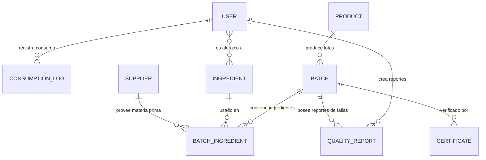

# NutriTrack - Trazabilidad Alimentaria para el Sector Fitness

## Información del Curso y Equipo

- **Curso:** CS 2031 Desarrollo Basado en Plataforma (DBP) - UTEC
- **Integrantes del Equipo:**
  * Víctor Valentino Palomino Arcos
  * Nestor Alonso De la Cruz Gomez
  * Keneth Joseph Urbizagastegui Fernández

---

## Índice

1. [Introducción](#introducción)
2. [Identificación del Problema o Necesidad](#identificación-del-problema-o-necesidad)
3. [Descripción de la Solución](#descripción-de-la-solución)
4. [Tecnologías Utilizadas](#tecnologías-utilizadas)
5. [Modelo de Entidades (Diagrama ER)](#modelo-de-entidades-diagrama-er)
6. [Arquitectura del Sistema y Despliegue en AWS](#arquitectura-del-sistema-y-despliegue-en-aws)
7. [Instrucciones de Instalación y Ejecución Local](#instrucciones-de-instalación-y-ejecución-local)
8. [Variables de Entorno Requeridas](#variables-de-entorno-requeridas)
9. [Documentación de Endpoints (API)](#documentación-de-endpoints-api)
10. [Medidas de Seguridad Implementadas](#medidas-de-seguridad-implementadas)
11. [Eventos y Asincronía](#eventos-y-asincronía)
12. [Testing y Manejo de Errores](#testing-y-manejo-de-errores)
13. [GitHub & Management](#github--management)
14. [Decisiones de Diseño](#decisiones-de-diseño)
15. [Conclusiones](#conclusiones)
16. [Apéndices](#apéndices)

---

## Introducción

NutriTrack es una plataforma diseñada para garantizar la transparencia, calidad e inocuidad de alimentos y suplementos en el sector fitness. Mediante un sistema de trazabilidad de lotes e ingredientes estructurado sobre Spring Boot, la aplicación conecta a proveedores, administradores y consumidores finales para mitigar riesgos alimentarios.

### Objetivos del Proyecto

- Proveer trazabilidad completa de lotes e ingredientes mediante códigos QR públicos.
- Automatizar alertas de retiro de mercado en tiempo real ante lotes contaminados.
- Registrar el consumo nutricional diario de usuarios fitness con detección de alérgenos.
- Garantizar la seguridad de datos mediante autenticación JWT y control de acceso por roles.

---

## Identificación del Problema o Necesidad

### Descripción del Problema

El mercado de suplementos deportivos y alimentos orientados al fitness carece de herramientas ágiles de trazabilidad. Los consumidores a menudo ignoran el origen exacto de los ingredientes de su proteína, creatina o comidas preparadas. En caso de contaminación de materias primas o lotes defectuosos, los retiros del mercado suelen ser lentos e ineficientes, exponiendo la salud de los usuarios.

### Justificación

La ausencia de sistemas de trazabilidad ágiles representa un riesgo sanitario directo para los consumidores. NutriTrack resuelve esta brecha ofreciendo visibilidad de trazabilidad mediante códigos QR interactivos y alertas automatizadas en tiempo real, reduciendo el tiempo de respuesta ante contingencias alimentarias de días a minutos.

---

## Descripción de la Solución

### Funcionalidades Implementadas

- **Módulo de Trazabilidad:** Registro detallado de lotes (`Batch`), ingredientes asociados (`Ingredient`), proveedores (`Supplier`) e histórico de frescura (`FreshnessStatus`).
- **Códigos QR Dinámicos:** Generación automática de códigos QR que apuntan a la URI de trazabilidad pública de cada lote, almacenados de forma segura en **Amazon S3**.
- **Módulo de Consumo:** Registro de consumo nutricional diario (`ConsumptionLog`) por parte de los usuarios fitness con detección automática de alérgenos registrados.
- **Sistema de Alertas Inmediatas:** Retiro automático de lotes (`RECALLED`) con disparo de eventos asíncronos que notifican vía correo a todos los usuarios expuestos al lote afectado.
- **Gestión de Reportes de Calidad:** Permite a los usuarios reportar anomalías alimenticias en lotes específicos, notificando automáticamente a los administradores.
- **Autenticación JWT con Refresh Tokens Rotativos:** Sistema completo de autenticación stateless con tokens de acceso y refresh tokens para sesiones seguras y prolongadas.

### Tecnologías Utilizadas

- **Lenguaje:** Java 21 (Temurin JRE)
- **Framework:** Spring Boot 3.4+ (Spring Data JPA, Spring Security, Spring Mail)
- **Base de Datos:** PostgreSQL 16 (Desarrollo/Producción), H2 (Tests Unitarios locales)
- **Seguridad:** JWT (JSON Web Tokens) con encriptación BCrypt para contraseñas, refresh token rotation
- **Almacenamiento en Cloud:** Amazon S3 (para almacenar PDFs de certificados y códigos QR)
- **API de Correo:** Resend (API/SMTP)
- **Documentación:** Swagger UI / OpenAPI 3.0
- **Mapeo de Objetos:** MapStruct (conversión DTO ↔ Entidad)
- **Generación de QR:** ZXing (Zebra Crossing)
- **Pruebas y QA:** JUnit 5, Mockito, Testcontainers (PostgreSQL integrado)
- **Dockerización:** Docker (compilación multi-etapa), Docker Compose

---

## Modelo de Entidades (Diagrama ER)

El modelo de datos cuenta con **9 entidades físicas** relacionales y **5 enums** diseñados para mitigar redundancias:



### Descripción de Entidades

| Entidad | Descripción | Atributos clave |
|---|---|---|
| `User` | Perfiles de usuario con roles y alérgenos registrados | `id`, `username`, `email`, `password`, `roles (Set<Role>)`, `allergens (Set<Ingredient>)` |
| `Product` | Catálogo de productos con macros nutricionales | `id`, `name`, `category (ProductCategory)`, `calories`, `protein`, `carbs`, `fat` |
| `Batch` | Lotes con trazabilidad, QR y estado de mercado | `id`, `batchCode`, `productionDate`, `expirationDate`, `status (BatchStatus)`, `qrCodeUrl` |
| `Ingredient` | Insumos con información de alérgenos | `id`, `name`, `isAllergen`, `description` |
| `Supplier` | Proveedores de materias primas | `id`, `name`, `country`, `isActive`, `contactEmail` |
| `BatchIngredient` | Asociación lote-ingrediente con cálculo de frescura | `id`, `arrivalDate`, `freshnessStatus (FreshnessStatus)` |
| `Certificate` | Documentos de laboratorio adjuntos al lote | `id`, `fileUrl`, `issueDate`, `certifyingLab` |
| `QualityReport` | Denuncias de calidad por usuarios | `id`, `description`, `status (QualityReportStatus)`, `createdAt` |
| `ConsumptionLog` | Diario alimentario del usuario | `id`, `consumedAt`, `quantity`, `notes` |

---

## Arquitectura del Sistema y Despliegue en AWS

El sistema opera de forma nativa en la nube (Cloud-Native) bajo la infraestructura de **AWS Academy** (Learner Lab):

```
                                      +------------------------------------+
                                      |            AWS VPC                 |
                                      |                                    |
+------------+     HTTP/HTTPS/API     |  +----------+       +-----------+  |
|   Cliente  | ---------------------> |  |   ALB    | ----> |    ECS    |  |
| (Frontend) |                        |  | (Port 80)|       | (Fargate) |  |
+------------+                        |  +----------+       +-----------+  |
      ^                               |                           |        |
      |                               |                           v        |
      | GET QR / PDFs                 |                     +-----------+  |
      +-------------------------------+-------------------  |  Amazon   |  |
                                      |                     |    RDS    |  |
                                      |                     | (Postgres)|  |
                                      |                     +-----------+  |
                                      +------------------------------------+
```

- **Pipeline de CI/CD (GitHub Actions):** Al hacer `git push` a `main`, la pipeline compila el JAR, construye la imagen Docker multi-etapa, la publica en **Amazon ECR** y actualiza la tarea de **Amazon ECS Fargate**.
- **Servicio Backend (ECS Fargate):** Ejecuta el contenedor serverless tras un **Application Load Balancer (ALB)**.
- **Persistencia (Amazon RDS):** PostgreSQL gestionada en subred privada, accesible solo desde el Security Group de ECS.
- **Archivos Estáticos (Amazon S3):** Almacenamiento seguro de códigos QR y PDFs de certificados.
- **Servicio de Alertas (Resend):** Envío asíncrono de correos HTML con Thymeleaf.

---

## Instrucciones de Instalación y Ejecución Local

### Prerrequisitos

- Java 21 JDK instalado
- Maven 3.9+ instalado
- Docker Desktop instalado y corriendo

### Pasos

1. **Clonar el repositorio:**
```bash
git clone https://github.com/keneth-urbizagastegui/NutriTrack-Backend.git
cd NutriTrack-Backend
```

2. **Levantar base de datos PostgreSQL local** con Docker Compose:
```bash
docker compose up -d
```

3. **Configurar el entorno:** Renombra `.env.example` a `.env` y configura tus credenciales.

4. **Compilar y ejecutar:**
```bash
mvn clean spring-boot:run
```

5. **Acceder a la documentación:** `http://localhost:8080/swagger-ui/index.html`

---

## Variables de Entorno Requeridas

| Variable | Descripción | Ejemplo |
|---|---|---|
| `DB_HOST` | Host de la base de datos | `localhost` |
| `DB_PORT` | Puerto de la base de datos | `5433` |
| `DB_NAME` | Nombre de la base de datos | `nutritrack_db` |
| `DB_USER` | Usuario de PostgreSQL | `postgres` |
| `DB_PASSWORD` | Contraseña de PostgreSQL | `postgres` |
| `JWT_SECRET` | Clave secreta para firmar tokens JWT | *Mínimo 32 caracteres* |
| `AWS_S3_BUCKET` | Bucket de S3 para certificados/QR | `nutritrack-certificates` |
| `AWS_REGION` | Región de AWS | `us-east-1` |
| `RESEND_API_KEY` | API Key de Resend para correos | `re_...` |
| `EMAIL_FROM` | Correo remitente | `onboarding@resend.dev` |
| `CORS_ORIGINS` | Dominios permitidos para CORS | `http://localhost:3000` |

---

## Documentación de Endpoints (API)

### Autenticación (`/api/v1/auth`)

| Método | Endpoint | Descripción | Auth |
|---|---|---|---|
| `POST` | `/register` | Registro de nuevos usuarios con validación de email único | Público |
| `POST` | `/login` | Inicio de sesión, retorna access token JWT + refresh token | Público |
| `POST` | `/refresh` | Renueva el access token usando un refresh token válido | Público |

### Productos (`/api/v1/products`)

| Método | Endpoint | Descripción | Auth |
|---|---|---|---|
| `GET` | `/` | Listado paginado con filtros dinámicos (Specification) y HATEOAS | Público |
| `POST` | `/` | Creación de producto con macros nutricionales | ADMIN / MANAGER |

### Lotes (`/api/v1/batches`)

| Método | Endpoint | Descripción | Auth |
|---|---|---|---|
| `POST` | `/` | Creación de lote + generación automática de QR en S3 | ADMIN |
| `GET` | `/{id}/traceability` | Consulta pública: ingredientes, proveedores y estado de frescura | Público |
| `PUT` | `/{id}/recall` | Retiro de lote — dispara `BatchRecallEvent` con alertas por correo | ADMIN |
| `POST` | `/{batchId}/ingredients` | Asocia ingrediente + proveedor a un lote con cálculo de frescura | ADMIN / MANAGER |

### Consumos (`/api/v1/consumptions`)

| Método | Endpoint | Descripción | Auth |
|---|---|---|---|
| `POST` | `/` | Registra consumo diario con detección automática de alérgenos | USER |
| `GET` | `/user` | Historial de consumo del usuario autenticado | USER |

### Proveedores (`/api/v1/suppliers`)

| Método | Endpoint | Descripción | Auth |
|---|---|---|---|
| `POST` | `/` | Creación de proveedor | ADMIN / MANAGER |
| `GET` | `/` | Listado paginado de todos los proveedores | Público |
| `GET` | `/{id}` | Detalle de proveedor por ID | Autenticado |

### Ingredientes (`/api/v1/ingredients`)

| Método | Endpoint | Descripción | Auth |
|---|---|---|---|
| `POST` | `/` | Creación de ingrediente | ADMIN / MANAGER |
| `GET` | `/` | Listado paginado de todos los ingredientes | Público |
| `GET` | `/{id}` | Detalle de ingrediente por ID | Autenticado |

---

## Medidas de Seguridad Implementadas

### Seguridad de Datos

- **Cifrado de Contraseñas:** `BCryptPasswordEncoder` (fuerza 10) definido en `SecurityConfig.java`.
- **Autenticación sin Estado:** `JwtAuthenticationFilter.java` extrae y valida el token Bearer del header `Authorization` mediante `JwtService.java`, estableciendo el `SecurityContext` de Spring.
- **Refresh Token Rotation:** Implementación de refresh tokens firmados con JWT. Cada renovación genera un nuevo par de tokens (access + refresh), invalidando el anterior para prevenir reutilización.
- **Autorización por Roles:** `ROLE_USER`, `ROLE_ADMIN`, `ROLE_MANAGER` mediante `@PreAuthorize` en controladores.
- **CORS Dinámico:** `CorsConfig.java` restringe orígenes cruzados a dominios inyectados por variable de entorno `CORS_ORIGINS`.

### Prevención de Vulnerabilidades

- **Inyección SQL:** Mitigada al 100% mediante Spring Data JPA + Hibernate con consultas parametrizadas.
- **CSRF:** Deshabilitado de forma segura al ser API REST stateless con JWT en memoria del cliente (no cookies).
- **XSS y Sanitización:** Validación estricta con `@Valid` (Hibernate Validator) en todos los DTOs de entrada.

---

## Eventos y Asincronía

### Eventos Personalizados

| Evento | Publicado en | Acción disparada |
|---|---|---|
| `UserRegisteredEvent` | `AuthService.java` | Envío de correo de bienvenida HTML (`welcome.html`) |
| `QualityReportCreatedEvent` | `QualityReportService.java` | Notificación a administradores sobre reporte de calidad |
| `BatchRecallEvent` | `BatchService.java` | Alertas masivas a usuarios expuestos al lote retirado (`batch-recall-alert.html`) |

### Procesamiento Asíncrono

- `@Async` + `@EnableAsync` configurados en `AsyncConfig.java`.
- **Pool de hilos personalizado** (`ThreadPoolTaskExecutor`): `corePoolSize=5`, `maxPoolSize=10`, `queueCapacity=25` — evita saturar los hilos del servidor Tomcat en picos de alertas masivas.
- Los listeners en `NotificationEventListener.java` procesan todos los eventos de forma no bloqueante, retornando la respuesta HTTP al cliente antes de completar el envío de correos.

### Servicio de Correo Electrónico

`EmailService.java` usa Thymeleaf Template Engine para compilar y enviar correos HTML con plantillas (`welcome.html`, `batch-recall-alert.html`, `quality-report-alert.html`) a través de la API de Resend. El envío es completamente asíncrono e incluye manejo de errores para no afectar el flujo principal.

---

## Testing y Manejo de Errores

### Niveles de Testing Realizados

**1. Capa de Persistencia (Repository Testing)**
- Pruebas aisladas con `@DataJpaTest` sobre base de datos H2 en memoria.
- Nomenclatura BDD (`shouldXxxWhenYyy`).
- Valida operaciones CRUD, existencia, unicidad y métodos de filtrado personalizado.

**2. Capa de Negocio (Service Unit Testing)**
- Aislamiento total con **Mockito** para mockear repositorios y APIs externas.
- Cobertura de rutas de éxito, lógica de negocio y manejo de excepciones.

**3. Capa de Integración (Controller Integration Testing)**
- Contenedor real PostgreSQL 16 levantado con **Testcontainers**.
- `@SpringBootTest(webEnvironment = RANDOM_PORT)` + MockMvc.
- Valida seguridad JWT, serialización/deserialización, códigos HTTP y flujos de los 7 controladores REST.

### Resultados

| Tipo de test | Archivo representativo | Tests | Resultado |
|---|---|---|---|
| Repository | `UserRepositoryTest.java` | ~12 | ✅ PASS |
| Repository | `BatchRepositoryTest.java` | ~8 | ✅ PASS |
| Service | `BatchServiceTest.java` | ~15 | ✅ PASS |
| Service | `AuthServiceTest.java` | ~12 | ✅ PASS |
| Integration | `ControllerIntegrationTest.java` | ~12 (7 controllers) | ✅ PASS |
| **Total** | | **47** | **BUILD SUCCESS** |

**Fallos resueltos durante el desarrollo:**
- *Incompatibilidad Spring Boot 4.x:* Corregido import de `@DataJpaTest` al nuevo paquete.
- *Error OpenAPI con ControllerAdvice:* Actualizado `springdoc-openapi` a versión `2.8.5`.
- *Consistencia de Enums:* Corregido uso de `ProductCategory.READY_MEAL` en datos de prueba.

### Manejo de Errores

Se centralizó la gestión de excepciones con `GlobalExceptionHandler.java` anotado con `@RestControllerAdvice`. Responde en formato uniforme `ErrorResponse` con `timestamp`, `status`, `error`, `message` y `path`.

#### Excepciones personalizadas implementadas

| Excepción | Código HTTP | Cuándo se lanza |
|---|---|---|
| `UserAlreadyExistsException` | 409 Conflict | Email o username ya registrado |
| `InvalidCredentialsException` | 401 Unauthorized | Credenciales incorrectas en login |
| `ResourceNotFoundException` | 404 Not Found | Entidad no encontrada por ID |
| `AllergenAlertException` | 400 Bad Request | Usuario consume producto con alérgeno registrado |
| `BatchRecallException` | 409 Conflict | Operación inválida sobre lote ya retirado del mercado |
| `SupplierNotActiveException` | 400 Bad Request | Intento de usar proveedor inactivo en un lote |
| `InvalidBatchDateException` | 400 Bad Request | Fecha de expiración anterior a fecha de producción |
| `InvalidFileFormatException` | 400 Bad Request | Formato de archivo no permitido para certificados |
| `ExpiredTokenException` | 401 Unauthorized | Token JWT de acceso o refresh expirado |

Además maneja `MethodArgumentNotValidException` (400), `AccessDeniedException` (403) y `Exception` general (500).

---

## GitHub & Management

### GitHub Projects (Tablero Kanban)

El proyecto se organizó mediante **GitHub Projects** con tablero Kanban de tres columnas (*Todo*, *In Progress*, *Done*). Se crearon **7 Issues** asignados por rol:

- **Víctor Valentino Palomino Arcos:** Seguridad JWT, CORS, Dockerización, despliegues y CI/CD.
- **Nestor Alonso De la Cruz Gomez:** Capa de datos, entidades, almacenamiento S3 y códigos QR.
- **Keneth Joseph Urbizagastegui Fernández:** Lógica de negocio, controladores, eventos asíncronos y testing.

### Pipeline CI/CD con GitHub Actions

Configurado en `.github/workflows/deploy-backend.yml`. Cada `push` a `main`:
1. Compila el JAR con Maven.
2. Construye la imagen Docker multi-etapa.
3. Publica la imagen en **Amazon ECR** con credenciales seguras (GitHub Secrets).
4. Actualiza la Task Definition en **Amazon ECS Fargate** detrás del ALB.

---

## Decisiones de Diseño

- **Inyección por Constructores:** Eliminado `@Autowired` por campo en favor de `@RequiredArgsConstructor` de Lombok, mejorando inmutabilidad y testeabilidad.
- **MapStruct para Mapeo Seguro:** Conversiones limpias DTO ↔ Entidad sin riesgo de fugar campos confidenciales (ej. `password`).
- **Filtros Dinámicos (Specification):** Patrón JPA Specification en `ProductSpecification.java` para búsquedas con criterios variables sin múltiples métodos en el repositorio.
- **JWT Stateless con Refresh Token Rotation:** Tokens de acceso de corta duración (1 hora) + refresh tokens rotativos para sesiones seguras sin estado en servidor.
- **Eventos para Desacoplamiento:** Los procesos IO-bound (correos, notificaciones) se desacoplan del flujo principal mediante eventos, mejorando el tiempo de respuesta de los endpoints críticos.

---

## Conclusiones

### Logros del Proyecto

- **Trazabilidad Completa:** Integración de ZXing + AWS S3 para mapear origen de insumos (lote, frescura) y disponibilizarlo públicamente mediante QR.
- **Arquitectura Escalable:** Desacoplamiento asíncrono para procesos IO-bound y persistencia robusta en PostgreSQL bajo Fargate.
- **Seguridad Robusta:** JWT con refresh token rotation, BCrypt, RBAC con 3 roles, y prevención de vulnerabilidades comunes.
- **Cobertura Total:** 47 pruebas automáticas (repositorios, servicios e integración) con Testcontainers y documentación interactiva (Swagger + Postman).

### Aprendizajes Clave

- Configuración avanzada de Spring Security 6 con filtros JWT personalizados y refresh token rotation.
- Administración de recursos serverless en AWS (ECS, RDS, ALB, S3, ECR, SSM Parameter Store).
- Orquestación de contenedores Docker multi-stage y Testcontainers para testing de integración real.
- Arquitectura orientada a eventos con `ApplicationEvent` para desacoplamiento de componentes.

### Trabajo Futuro

- Añadir WebSockets para actualizar en tiempo real alertas de lotes contaminados en el frontend.
- Integrar autenticación OAuth2 mediante redes sociales (Google, GitHub).
- Implementar cobertura de tests superior al 80% con JaCoCo.
- Migrar a arquitectura de microservicios separando el módulo de alertas del core de trazabilidad.

---

## Apéndices

### Licencia

Este proyecto se distribuye bajo la licencia MIT. Consulta el archivo `LICENSE` para más información.

### Referencias

- *Spring Boot Documentation:* https://docs.spring.io/spring-boot/
- *Hibernate ORM Core:* https://hibernate.org/orm/
- *AWS SDK for Java v2 (S3 Client):* https://docs.aws.amazon.com/sdk-for-java/latest/developer-guide/home.html
- *Thymeleaf Java Template Engine:* https://www.thymeleaf.org/
- *Testcontainers for Java:* https://java.testcontainers.org/
- *OpenAPI 3.0 Specification:* https://swagger.io/specification/
- *MapStruct Documentation:* https://mapstruct.org/documentation/stable/reference/html/
- *ZXing (QR Generation):* https://github.com/zxing/zxing
