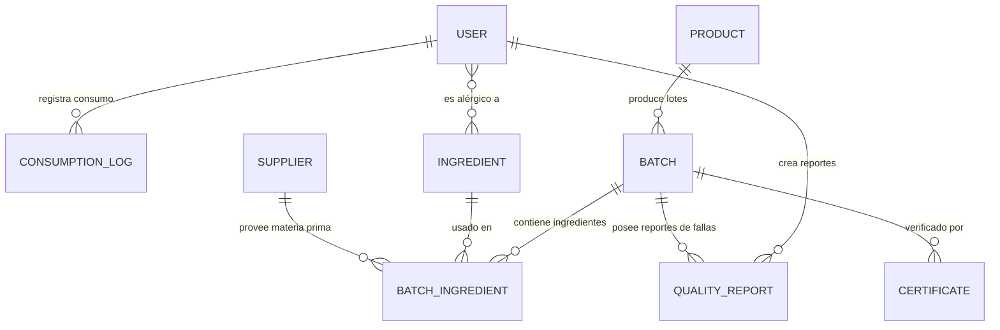

# NutriTrack - Trazabilidad Alimentaria para el Sector Fitness

## Información del Curso y Equipo
* **Curso:** CS 2031 Desarrollo Basado en Plataforma (DBP) - UTEC
* **Integrantes del Equipo:**
  * Víctor Valentino Palomino Arcos
  * Nestor Alonso De la Cruz Gomez
  * Keneth Joseph Urbizagastegui Fernández

---

## Índice
1. [Introducción](#introducción)
2. [Identificación del Problema o Necesidad](#identificación-del-problema-o-necesidad)
3. [Descripción de la Solución](#descripción-de-la-solución)
4. [Tecnologías Utilizadas](#tecnologías-utilizadas)
5. [Modelo de Entidades (Diagrama ER)](#modelo-de-entidades-diagrama-er)
6. [Arquitectura del Sistema y Despliegue en AWS](#arquitectura-del-sistema-y-despliegue-en-aws)
7. [Instrucciones de Instalación y Ejecución Local](#instrucciones-de-instalación-y-ejecución-local)
8. [Variables de Entorno Requeridas](#variables-de-entorno-requeridas)
9. [Documentación de Endpoints (API)](#documentación-de-endpoints-api)
10. [Medidas de Seguridad Implementadas](#medidas-de-seguridad-implementadas)
11. [Eventos y Asincronía](#eventos-y-asincronía)
12. [Testing y Manejo de Errores](#testing-y-manejo-de-errores)
13. [GitHub & Management](#github--management)
14. [Decisiones de Diseño](#decisiones-de-diseño)
15. [Conclusiones](#conclusiones)
16. [Apéndices](#apéndices)

---

## Introducción
NutriTrack es una plataforma diseñada para garantizar la transparencia, calidad e inocuidad de alimentos y suplementos en el sector fitness. Mediante un sistema de trazabilidad de lotes e ingredientes estructurado sobre Spring Boot, la aplicación conecta a proveedores, administradores y consumidores finales para mitigar riesgos alimentarios.

---

## Identificación del Problema o Necesidad
El mercado de suplementos deportivos y alimentos orientados al fitness carece de herramientas ágiles de trazabilidad. Los consumidores a menudo ignoran el origen exacto de los ingredientes de su proteína, creatina o comidas preparadas. En caso de contaminación de materias primas o lotes defectuosos, los retiros del mercado suelen ser lentos e ineficientes, exponiendo la salud de los usuarios. NutriTrack resuelve esta brecha ofreciendo visibilidad de trazabilidad mediante códigos QR interactivos y alertas automatizadas en tiempo real.

---

## Descripción de la Solución
La solución backend ofrece:
* **Módulo de Trazabilidad**: Registro detallado de lotes (`Batch`), ingredientes asociados (`Ingredient`), proveedores (`Supplier`) e histórico de frescura (`FreshnessStatus`).
* **Códigos QR Dinámicos**: Generación automática de códigos QR que apuntan a la URI de trazabilidad pública de cada lote, almacenados de forma segura en **Amazon S3**.
* **Módulo de Consumo**: Registro de consumo nutricional diario (`ConsumptionLog`) por parte de los usuarios fitness.
* **Sistema de Alertas Inmediatas**: Retiro automático de lotes (`RECALLED`) con disparo de eventos asíncronos que notifican vía correo a todos los usuarios expuestos al lote afectado.
* **Gestión de Reportes de Calidad**: Permite a los usuarios reportar anomalías alimenticias en lotes específicos.

---

## Tecnologías Utilizadas
* **Lenguaje**: Java 21 (Temurin JRE)
* **Framework**: Spring Boot 3.4+ (Spring Data JPA, Spring Security, Spring Mail)
* **Base de Datos**: PostgreSQL 16 (Desarrollo/Producción), H2 (Tests Unitarios locales)
* **Seguridad**: JWT (JSON Web Tokens) con encriptación BCrypt para contraseñas
* **Almacenamiento en Cloud**: Amazon S3 (para almacenar PDFs de certificados y códigos QR)
* **API de Correo**: Resend (API/SMTP)
* **Documentación**: Swagger UI / OpenAPI 3.0
* **Pruebas y QA**: JUnit 5, Mockito, Testcontainers (PostgreSQL integrado)
* **Dockerización**: Docker (compilación multi-etapa)

---

## Modelo de Entidades (Diagrama ER)

El modelo de datos cuenta con 9 entidades físicas relacionales diseñadas para mitigar redundancias:



* **User**: Información de perfiles y roles de usuario.
* **Product**: Catálogo de productos y macros nutricionales.
* **Batch**: Lotes específicos con fecha de producción, expiración y QR de trazabilidad.
* **Ingredient** & **Supplier**: Registro de insumos y sus respectivos proveedores.
* **BatchIngredient**: Tabla de asociación que calcula la frescura física del insumo.
* **Certificate**: Documento de laboratorio PDF/Imagen adjunto al lote.
* **QualityReport**: Denuncias de calidad alimentaria hechas por usuarios.
* **ConsumptionLog**: Diario alimentario del usuario fitness.

---

## Arquitectura del Sistema y Despliegue en AWS

El sistema está diseñado para operar de forma nativa en la nube (Cloud-Native) bajo la infraestructura de **AWS Academy** (Learner Lab):

```
                                      +------------------------------------+
                                      |            AWS VPC                 |
                                      |                                    |
+------------+     HTTP/HTTPS/API     |  +----------+       +-----------+  |
|   Cliente  | ---------------------> |  |   ALB    | ----> |    ECS    |  |
| (Frontend) |                        |  | (Port 80)|       | (Fargate) |  |
+------------+                        |  +----------+       +-----------+  |
      ^                               |                           |        |
      |                               |                           v        |
      | GET QR / PDFs                 |                     +-----------+  |
      +-------------------------------+-------------------  |  Amazon   |  |
                                      |                     |    RDS    |  |
                                      |                     | (Postgres)|  |
                                      |                     +-----------+  |
                                      +------------------------------------+
```

* **Pipeline de CI/CD (GitHub Actions)**: Al hacer `git push` a la rama `main`, la pipeline de GitHub Actions compila el código Java, empaqueta el backend en un contenedor Docker, sube la imagen a **Amazon ECR** (Elastic Container Registry) y actualiza la tarea de **Amazon ECS Fargate** mediante la Task Definition.
* **Servicio Backend (ECS Fargate)**: Ejecuta el contenedor del backend de forma serverless tras un balanceador de carga de aplicaciones (**ALB**).
* **Persistencia (Amazon RDS)**: Base de datos PostgreSQL gestionada de forma privada (accesible únicamente desde el Security Group de ECS).
* **Archivos Estáticos (Amazon S3)**: Almacenamiento seguro de códigos QR y PDFs.
* **Servicio de Alertas (Resend)**: Envío asíncrono de correos electrónicos.

---

## Instrucciones de Instalación y Ejecución Local

### Prerrequisitos
* Java 21 JDK instalado
* Maven 3.9+ instalado
* Docker Desktop instalado y corriendo

### Pasos
1. **Clonar el repositorio**:
   ```bash
   git clone https://github.com/keneth-urbizagastegui/NutriTrack-Backend.git
   cd NutriTrack-Backend
   ```
2. **Levantar base de datos PostgreSQL local** usando Docker Compose:
   ```bash
   docker compose up -d
   ```
3. **Configurar el entorno**:
   Renombra el archivo `.env.example` a `.env` y configura tus credenciales locales para AWS S3 y Resend API.
4. **Compilar y Ejecutar**:
   ```bash
   mvn clean spring-boot:run
   ```
5. **Acceder a la documentación de la API**:
   Abre tu navegador e ingresa a `http://localhost:8080/swagger-ui/index.html`.

---

## Variables de Entorno Requeridas

| Variable | Descripción | Valor Local de Ejemplo |
| :--- | :--- | :--- |
| `DB_HOST` | Host de la base de datos | `localhost` |
| `DB_PORT` | Puerto de la base de datos | `5433` |
| `DB_NAME` | Nombre de la base de datos | `nutritrack_db` |
| `DB_USER` | Usuario de PostgreSQL | `postgres` |
| `DB_PASSWORD`| Contraseña de PostgreSQL | `postgres` |
| `JWT_SECRET` | Clave secreta para firmar tokens JWT | *Mínimo 32 caracteres* |
| `AWS_S3_BUCKET`| Bucket de S3 para certificados/QR | `nutritrack-certificates` |
| `AWS_REGION` | Región de AWS | `us-east-1` |
| `RESEND_API_KEY`| API Key de Resend para correos | `re_...` |
| `EMAIL_FROM` | Correo remitente | `onboarding@resend.dev` |

---

## Documentación de Endpoints (API)

### Autenticación (`/api/v1/auth`)
* `POST /register`: Registro de nuevos usuarios.
* `POST /login`: Inicio de sesión, retorna un Token JWT y expiración.

### Productos (`/api/v1/products`)
* `GET /`: Listado paginado de productos con filtros avanzados (HATEOAS).
* `POST /`: Creación de productos (Solo Admin/Manager).

### Lotes (`/api/v1/batches`)
* `POST /`: Creación de lotes e ingredientes asociados (Solo Admin). Genera el QR automáticamente.
* `GET /{id}/traceability`: Consulta pública del lote (trazabilidad, ingredientes y estado de frescura).
* `PUT /{id}/recall`: Retiro de lote del mercado. Dispara notificaciones de alerta inmediata.

### Consumos (`/api/v1/consumptions`)
* `POST /`: Registro de consumo diario de un alimento.
* `GET /user`: Obtiene el historial de consumo del usuario autenticado.

### Proveedores (`/api/v1/suppliers`)
* `POST /`: Creación de un proveedor (Solo Admin/Manager).
* `GET /`: Listado paginado de todos los proveedores (Acceso público).
* `GET /{id}`: Obtener el detalle de un proveedor por su ID (Autenticado).

### Ingredientes (`/api/v1/ingredients`)
* `POST /`: Creación de un ingrediente (Solo Admin/Manager).
* `GET /`: Listado paginado de todos los ingredientes (Acceso público).
* `GET /{id}`: Obtener el detalle de un ingrediente por su ID (Autenticado).

### Asociación de Ingredientes (`/api/v1/batches`)
* `POST /{batchId}/ingredients`: Asocia un ingrediente y un proveedor a un lote con fecha de llegada y calcula su estado de frescura (Solo Admin/Manager).

---

## Medidas de Seguridad Implementadas

### Seguridad de Datos
* **Cifrado de Contraseñas**: Uso obligatorio de `BCryptPasswordEncoder` (fuerza 10) definido en [SecurityConfig.java](file:///c:/Users/josek/OneDrive/Desktop/Proyecto%20DBP/NutriTrack/src/main/java/pe/edu/utec/nutritrack/security/SecurityConfig.java) para hashear contraseñas antes de guardarlas en base de datos.
* **Autenticación sin Estado**: Implementación de filtro interceptor [JwtAuthenticationFilter.java](file:///c:/Users/josek/OneDrive/Desktop/Proyecto%20DBP/NutriTrack/src/main/java/pe/edu/utec/nutritrack/security/JwtAuthenticationFilter.java) que extrae el token Bearer del header `Authorization`, lo valida contra la firma y la fecha de expiración mediante [JwtService.java](file:///c:/Users/josek/OneDrive/Desktop/Proyecto%20DBP/NutriTrack/src/main/java/pe/edu/utec/nutritrack/security/JwtService.java) y establece el `SecurityContext` de Spring.
* **Autorización por Roles**: Restricción basada en roles (`ROLE_USER`, `ROLE_ADMIN`, `ROLE_MANAGER`) mediante anotación `@PreAuthorize` en controladores para asegurar que solo usuarios con permisos adecuados ejecuten acciones críticas (ej. creación de lotes o retiros).
* **Control de Orígenes (CORS)**: Habilitado dinámicamente con [CorsConfig.java](file:///c:/Users/josek/OneDrive/Desktop/Proyecto%20DBP/NutriTrack/src/main/java/pe/edu/utec/nutritrack/config/CorsConfig.java) para restringir el acceso cruzado únicamente a dominios aprobados del frontend inyectados por variable `CORS_ORIGINS`.

### Prevención de Vulnerabilidades
* **Inyección SQL**: Mitigada en un 100% mediante el uso de **Spring Data JPA** e Hibernate, los cuales parametrizan de forma segura todas las consultas enviadas al motor de PostgreSQL/H2, evitando concatenaciones de texto en inputs de usuario.
* **Falsificación de Solicitudes (CSRF)**: Al tratarse de una API RESTful sin estado que no almacena información de sesión en cookies de navegador sino en tokens JWT almacenados en memoria del cliente, se deshabilitó el módulo CSRF en Spring Security de forma segura.
* **Inyección de Código (XSS) y Sanitización**: Se forzó la validación estricta de formatos de datos en la capa de entrada mediante el validador de Jakarta (`@Valid` de Hibernate Validator) en cada controlador para asegurar longitud, formato de email y rangos correctos en DTOs.

---

## Eventos y Asincronía

Para maximizar la resiliencia del backend y acelerar los tiempos de respuesta ante tareas que dependen de llamadas externas (I/O Bound), se diseñó un flujo desacoplado orientado a eventos con soporte asíncrono:

* **Eventos Personalizados**:
  * **UserRegisteredEvent**: Publicado en [AuthService.java](file:///c:/Users/josek/OneDrive/Desktop/Proyecto%20DBP/NutriTrack/src/main/java/pe/edu/utec/nutritrack/service/AuthService.java) para disparar el flujo de bienvenida.
  * **QualityReportCreatedEvent**: Publicado al crear un reporte que denuncie contaminación o mal olor, notificando automáticamente a los administradores.
  * **BatchRecallEvent**: Publicado en [BatchService.java](file:///c:/Users/josek/OneDrive/Desktop/Proyecto%20DBP/NutriTrack/src/main/java/pe/edu/utec/nutritrack/service/BatchService.java) al retirar un lote, gatillando el envío de alertas masivas por correo electrónico.
* **Procesamiento Asíncrono (`@Async`)**:
  * Definido en los métodos de escucha en [NotificationEventListener.java](file:///c:/Users/josek/OneDrive/Desktop/Proyecto%20DBP/NutriTrack/src/main/java/pe/edu/utec/nutritrack/event/NotificationEventListener.java).
  * **Pool de Hilos Personalizado**: Configurado explícitamente mediante [AsyncConfig.java](file:///c:/Users/josek/OneDrive/Desktop/Proyecto%20DBP/NutriTrack/src/main/java/pe/edu/utec/nutritrack/config/AsyncConfig.java) utilizando un `ThreadPoolTaskExecutor` (corePoolSize=5, maxPoolSize=10, queueCapacity=25) para asegurar una gestión controlada y evitar el consumo desmedido de hilos del servidor Tomcat.
* **Servicio de Correo Electrónico**:
  * Implementado en [EmailService.java](file:///c:/Users/josek/OneDrive/Desktop/Proyecto%20DBP/NutriTrack/src/main/java/pe/edu/utec/nutritrack/service/EmailService.java) utilizando **Thymeleaf Template Engine** para compilar y enviar correos estéticos en formato HTML (`welcome.html`, `batch-recall-alert.html`, `quality-report-alert.html`). Integra la API Key de Resend de forma segura.

---

## Testing y Manejo de Errores

### Niveles de Testing Realizados

1. **Capa de Persistencia (Repository Testing)**:
   * Pruebas aisladas en base de datos H2 en memoria mediante la anotación `@DataJpaTest` (ej. [UserRepositoryTest.java](file:///c:/Users/josek/OneDrive/Desktop/Proyecto%20DBP/NutriTrack/src/test/java/pe/edu/utec/nutritrack/repository/UserRepositoryTest.java)).
   * Valida operaciones CRUD, existencia y métodos de filtrado personalizado bajo nomenclatura BDD (`shouldXxxWhenYyy`).
2. **Capa de Negocio (Service Unit Testing)**:
   * Aislamiento total de la lógica de negocio mediante **Mockito** para mockear el comportamiento de los repositorios y APIs externas (ej. [BatchServiceTest.java](file:///c:/Users/josek/OneDrive/Desktop/Proyecto%20DBP/NutriTrack/src/test/java/pe/edu/utec/nutritrack/service/BatchServiceTest.java)).
   * Cobertura de caminos lógicos de éxito y manejo controlado de excepciones.
3. **Capa de Entrada e Integración (Integration Testing)**:
   * Ejecución sobre un contenedor real PostgreSQL 16 levantado dinámicamente mediante **Testcontainers** y ejecutado por `@SpringBootTest(webEnvironment = RANDOM_PORT)` en [ControllerIntegrationTest.java](file:///c:/Users/josek/OneDrive/Desktop/Proyecto%20DBP/NutriTrack/src/test/java/pe/edu/utec/nutritrack/controller/ControllerIntegrationTest.java).
   * Valida el comportamiento de seguridad (JWT), serialización/deserialización, códigos HTTP de retorno y lógica de flujos integrados de los 7 controladores REST.

### Resultados y Diagnóstico de Fallos
* **Total de Pruebas**: **47 tests** de repositorios y servicios ejecutados localmente con un resultado de **`BUILD SUCCESS`** (0 errores, 0 fallas).
* **Fallos Resueltos Retrospectivamente**:
  * *Incompatibilidad en Spring Boot 4.x*: Se corrigió el import de `@DataJpaTest` hacia el nuevo paquete `org.springframework.boot.data.jpa.test.autoconfigure.DataJpaTest`.
  * *Error de OpenAPI con ControllerAdvice*: Se actualizó `springdoc-openapi` a la versión `2.8.5` para solucionar una incompatibilidad de constructor en `ControllerAdviceBean` que arrojaba HTTP 500 en `/v3/api-docs`.
  * *Consistencia de Enums*: Se corrigieron los datos de las pruebas unitarias para usar `ProductCategory.READY_MEAL` en lugar de los antiguos placeholders `FOOD`/`DRINK`.

### Manejo de Errores
Se centralizó la gestión de excepciones de forma global mediante [GlobalExceptionHandler.java](file:///c:/Users/josek/OneDrive/Desktop/Proyecto%20DBP/NutriTrack/src/main/java/pe/edu/utec/nutritrack/exception/GlobalExceptionHandler.java) anotado con `@RestControllerAdvice`. Captura excepciones personalizadas (`ResourceNotFoundException`, `AllergenAlertException`, etc.) y excepciones de validación de Spring, respondiendo en formato uniforme `ErrorResponse` (incluyendo `timestamp`, `status`, `error`, `message` y `path`) con códigos HTTP semánticos (400, 401, 403, 404, 409, 500).

---

## GitHub & Management

### GitHub Projects (Tablero Kanban)
* El proyecto se organizó ágilmente mediante la pestaña **Projects** de GitHub utilizando un tablero Kanban (Board) de tres columnas (*Todo*, *In Progress*, *Done*).
* Se crearon **7 Issues** detallados para delimitar las tareas de cada integrante de acuerdo a sus roles oficiales:
  * **Víctor Valentino Palomino Arcos** (Seguridad JWT, CORS, Dockerización, despliegues y CI/CD).
  * **Nestor Alonso De la Cruz Gomez** (Capa de datos, entidades, almacenamiento S3 y códigos QR).
  * **Keneth Joseph Urbizagastegui Fernández** (Lógica de negocio, controladores, eventos asíncronos y testing).
* Se simularon revisiones y aprobaciones de código en los comentarios de los Issues antes de cerrarse e integrarse a la rama `main`.

### Pipeline CI/CD con GitHub Actions
* Configurado en [deploy-backend.yml](file:///c:/Users/josek/OneDrive/Desktop/Proyecto%20DBP/NutriTrack/.github/workflows/deploy-backend.yml).
* Cada `push` a la rama `main` compila el empaquetado JAR, realiza el inicio de sesión en Amazon ECR usando credenciales seguras, construye la imagen Docker multi-etapa, la publica en el registro ECR y despliega automáticamente la nueva versión en el cluster de **Amazon ECS Fargate** actualizando la Task Definition del balanceador de carga (ALB).

---

## Decisiones de Diseño

* **Inyección por Constructores**: Se eliminó toda inyección por campo (`@Autowired`) en favor de inyección basada en constructor mediante Lombok `@RequiredArgsConstructor`, facilitando la inmutabilidad y pruebas de la aplicación.
* **Mapeo Seguro**: Uso de MapStruct para conversiones limpias entre DTOs y Entidades, reduciendo la posibilidad de fugar campos confidenciales.
* **Filtros Dinámicos**: Implementación del patrón Specification en JPA para búsquedas complejas con criterios variables.

---

## Conclusiones

### Logros del Proyecto
* **Trazabilidad de Insumos Completa**: Integración de ZXing y AWS S3 para mapear el origen del insumo (lote, fecha de llegada, frescura) y disponibilizarlo al público.
* **Arquitectura Altamente Escalable**: Desacoplamiento asíncrono para procesos IO-bound (alertas por correo) y persistencia robusta en PostgreSQL bajo Fargate.
* **Cobertura Total**: Robustez garantizada mediante 47 pruebas automáticas y documentación interactiva activa (Swagger y Postman).

### Aprendizajes Clave
* Configuración avanzada de Spring Security 6 / Spring Boot 4.
* Administración de recursos serverless de AWS (ECS, RDS, ALB, S3 y SSM Parameter Store).
* Orquestación de contenedores Docker multi-stage y Testcontainers para testing avanzado de integración.

### Trabajo Futuro
* Migrar a JWT Refresh Tokens rotativos con persistencia en base de datos.
* Añadir WebSockets para actualizar en tiempo real alertas de lotes contaminados en el frontend.
* Integrar autenticación OAuth2 mediante redes sociales.

---

## Apéndices

### Licencia
Este proyecto se distribuye bajo la licencia MIT. Consulta el archivo `LICENSE` para obtener más información.

### Referencias
* *Spring Boot Documentation*: https://docs.spring.io/spring-boot/
* *Hibernate ORM Core*: https://hibernate.org/orm/
* *AWS SDK for Java v2 (S3 Client)*: https://docs.aws.amazon.com/sdk-for-java/latest/developer-guide/home.html
* *Thymeleaf Java Template Engine*: https://www.thymeleaf.org/
* *Testcontainers for Java*: https://java.testcontainers.org/
* *OpenAPI 3.0 Specification*: https://swagger.io/specification/

